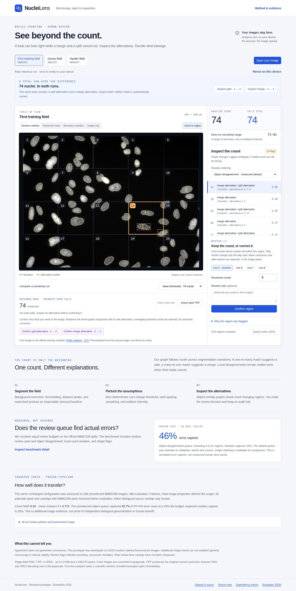
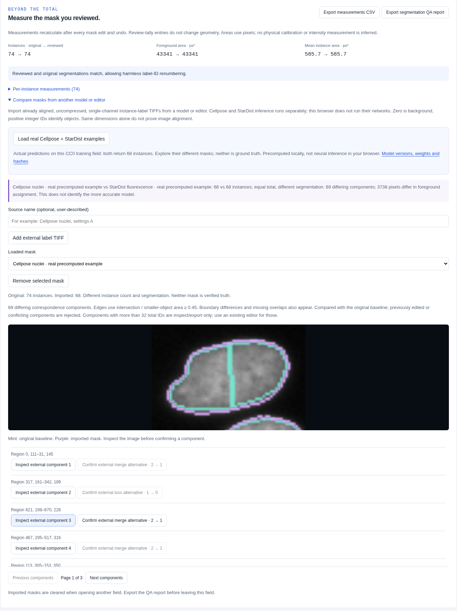
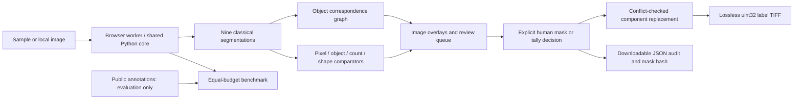

# NucleiLens

**See beyond the count.**

NucleiLens helps biology students and researchers inspect nuclei-count ambiguity
by comparing local segmentation alternatives and recording human review decisions.

[Live demo](https://nuclei-lens.dumbthing999.chatgpt.site) · [3:35 video](https://youtu.be/nik8WtPUrUc) · [Devpost](https://devpost.com/software/nucleilens)

[Video download backup](https://github.com/dumbthing999-ui/nuclei-lens/releases/download/v0.2.0/eurekadev-reviewed-720p.mp4) — the same 3:35 demo at 720p (26.7 MB).



## Problem

A field-level count can conceal opposing local mistakes: merging two nuclei
removes one, while splitting another adds one. The total stays unchanged.
Microscopy research distinguishes these instance errors from pixel overlap;
the public [BBBC039 benchmark](https://bbbc.broadinstitute.org/BBBC039) provides
200 U2OS fluorescence fields and approximately 23,000 annotated nuclei for
inspectable evaluation. See [Caicedo et al.](https://doi.org/10.1002/cyto.a.23863).

## Solution

Open a real sample or your own single-field image. Inspect baseline and alternative
outlines, inspect an opposing split/merge, explicitly confirm a mask alternative,
and export a lossless label TIFF plus its audit record. Optional manual tallies
remain separate from mask geometry.
Uploaded images are analyzed by Python in a dedicated browser worker; image bytes
stay on the device. Hosting and runtime-asset requests still occur, including a
Cloudflare challenge observed in the tested deployment; this is not anonymous
browsing or a privacy guarantee. There is no LLM, account, database, or paid inference service.
Mask edits and manual tally entries remain independent; each accepted mask edit
or undo reports the changed mask count beside the unchanged review-tally total.

## Why it is different

The core graph follows objects across nine controlled segmentation variations.
Connected correspondence components distinguish count-changing splits/merges from
count-neutral boundary variation. Tests demonstrate that opposing local changes
remain visible when total counts cancel. The interface exposes the actual alternative
masks and keeps user corrections separate from algorithm outputs.

We do **not** claim to invent watershed, graph correspondence, or uncertainty-guided
review. Initial comparisons show simpler object-disagreement ranking can outperform
the graph. Both orderings are available, and all recorded experiments remain visible.
The contribution is an original, reproducible inspection workflow and implementation;
comparative scientific superiority is not established. See the sourced
[comparison with established bioimage tools](docs/PRODUCT_COMPARISON.md).

## Demo

[Watch the 3:35 demo](https://www.youtube.com/watch?v=nik8WtPUrUc).

[Open the live application](https://nuclei-lens.dumbthing999.chatgpt.site). No login is required.
The public deployment passed real browser-local inference, review, undo, export, and mobile layout checks.
Source: [dumbthing999-ui/nuclei-lens](https://github.com/dumbthing999-ui/nuclei-lens).
The unlisted video is processed in HD and attached to Devpost. Anonymous 1080p
opening-sample playback with audio is verified; full browser-player viewing and
all-region availability are not claimed. See [delivery evidence](demo/README.md).

## Segmentation QA and model comparisons

Open **Compare masks from another model or editor**, then **Load real Cellpose +
StarDist examples** on the first training field. Both actual pretrained models
returned68instances, with different partitions. View the source/version/weight
hashes and compare the outlines. These are precomputed CPU predictions, not
browser neural inference, ground truth or a comparative accuracy benchmark.
You can also import up to three aligned, uncompressed unsigned label TIFFs.

Inspect the full-field overlay and explicitly acknowledge alignment before confirming an external component. This records your judgment, not independently verified alignment. Existing conflict checks,
fresh IDs and exact undo protect mask integrity. Pixel area, centroid, grid-edge
perimeter and border measurements recalculate from the actual edited mask.
Export the CSV, TIFF and QA JSON to trace same-count differences and source hashes.


See [QA semantics and bounds](docs/MASK_QA.md) and the
[optional local model runner](docs/OPTIONAL_MODELS.md).

Cellpose, StarDist, napari and [CellSampler](https://doi.org/10.3389/fgene.2025.1547788)
already establish segmentation, correction and model combination. These additions
make the review workflow concrete; they do not establish scientific novelty or
measured human benefit. The frozen evaluation results remain unchanged.

## Architecture



See [architecture](docs/architecture.md), [innovation](docs/INNOVATION.md), and
[security review](docs/security-review.md).

## How it works

1. Validate a bounded single-field image and preserve its input hash.
2. Normalize intensity; check a robust contrast/noise heuristic.
3. Segment with background correction, Otsu foreground, distance peaks, watershed,
   and minimum-area filtering. Saturated plateaus trigger a threshold safeguard.
4. Repeat with threshold, seed spacing, smoothing, and midtone perturbations.
5. Build sparse overlap graphs: edges require 45% coverage of the smaller object;
   unequal component cardinality yields local disagreement events.
6. Rank 20 fixed tiles and show each alternative. A sensitivity range is **not**
   a calibrated confidence interval, and a flag is **not** proof of error.
7. Confirm a whole graph-component alternative: replace only its original instances,
   reject overlap with retained nuclei, and allocate fresh IDs. Undo restores exact pixels.
8. Export the edited uint32 label TIFF and SHA256-linked audit. Optional tally entries
   remain independent; neither workflow changes reference annotations.

## Try the same-total example

1. Click **Inspect split · 1 → 2** and compare the actual outlines.
2. If you choose that alternative, click **Confirm split alternative**: mask74→75.
3. Inspect and confirm the opposing merge: mask75→74, with different pixels.
4. Export **label TIFF** and **review JSON**, then use **Undo mask edit**.

The alternatives are real, but this sequence is a workflow demonstration, not a
claim that both choices are biologically correct. Conflict checks reject edits
that overlap retained instances. See [mask review semantics](docs/MASK_REVIEW.md).

## Results and evaluation

Actual experiments are under [`evaluation/experiments`](evaluation/experiments). Across all 50 official validation fields, the selected classical segmentation configuration has count MAE **5.10** and mean instance F1 **0.824**. Validation guided development; it is not held-out proof.

| Queue | FP+FN error capture at 20% review budget (validation) |
|---|---:|
| Object disagreement — selected default | 44.0% |
| Count-changing graph — explanation layer | 38.4% |
| Pixel disagreement | 37.3% |
| Random (expected) | 20.0% |

Graph minus object disagreement is −5.6 percentage points (paired bootstrap 95% interval −8.4 to −3.4). The graph hypothesis failed its superiority target. A nonnegative ranker (four features plus one intercept; five fitted coefficients) trained on the official 100 training fields also failed its adoption gate (43.56% validation capture); it is retained as a rejected experiment, not shipped. Initial failures, including MAE 25.06 before safeguards, remain available.

The primary metric uses cardinality-first matching at instance IoU ≥ 0.5. All policies review the same four of twenty nonoverlapping centroid-assigned tiles; ties use expected capture. Image-level bootstrap intervals and complete curves are saved. Annotations load **after** inference. The fixed test protocol and configuration were saved before test access in [`evaluation/frozen`](evaluation/frozen). The first test process was interrupted by an environment restart and rerun under the identical frozen protocol; no test-driven changes were made. All 50 records are now saved and the output source/configuration hashes match the frozen protocol.

Secondary local-count errors and oracle correction curves are separate simulations. No human time savings, clinical benefit, or superior segmentation accuracy is claimed.

### Frozen held-out assessment

The complete 50-image official test set, evaluated with the saved configuration and source hashes, has count MAE **5.12** and mean instance F1 **0.827**. The preselected object-disagreement queue captures **45.8%** of FP+FN error mass at 20% review, versus **39.5%** graph, **39.0%** pixel disagreement, and **20.0%** expected random. This measures concentration of annotated errors, not automatic correction or human time savings.

Four test fields have exactly correct total counts while retaining **100 unmatched instances in total** (50 false positives and 50 false negatives). Counts alone conceal those mismatches. They are IoU-matching errors, not 100 confirmed biological split/merge diagnoses. Full per-image results, failure cases, intervals, and source hashes: [`evaluation/test`](evaluation/test).

### Additional image assessment

The unchanged pipeline was also assessed on **496 preselected BBBC038 images**:
count MAE **6.54**, mean instance F1 **0.772**, object-queue capture **45.7%** at a
20% tile budget, versus **39.3%** graph and **20.0%** expected random. All 496 were
retained, with zero structural reference/inference failures; 37 have F1<0.5.
Selection and source hashes were publicly frozen before inference. 43 potential
same-size content overlaps were excluded first; other shared biological sources
may remain. This property-filtered labeled training archive is **not an independent
biological-group test** or proof of human benefit. Original reference imperfections
remain in scoring. [Complete protocol, every field and difficult cases](evaluation/additional/README.md).

### Existing model-mask diagnostic

On the first bundled training field, all three existing masks have absolute count
error of **3**. At IoU ≥ 0.5, matching leaves **11 unmatched instances** for the
classical mask and **3** each for Cellpose and StarDist. The neural masks both
count **68** and have an F1 of **0.978**, yet differ at **3,738 foreground pixels**.
Those differences do not establish an error in either mask.
This is one previously visible development field, not a general model ranking.
[Reproduce the complete case and chart](evaluation/model-case/README.md).

## Tech stack

- Python, NumPy, SciPy, scikit-image: inspectable numerical segmentation and graph analysis.
- React, TypeScript, Vite: responsive review surface and typed correction state.
- Pyodide/WebAssembly: execute the same scientific core inside the browser.
- FastAPI: optional local CPU companion, not required by the deployed client.
- pytest, Vitest, Playwright, Ruff, pip-audit: actual checks and release evidence.

## Getting started

Python 3.14 and Node 26 are used. From the repository root:

```bash
python3.14 -m venv .venv
.venv/bin/pip install -e '.[dev]' -c requirements.lock
npm ci --prefix frontend
node scripts/sync_engine.mjs
node scripts/prepare_runtime.mjs
.venv/bin/python scripts/collect_notices.py
npm run dev --prefix frontend
```

Open `http://127.0.0.1:5173`. Bundled samples are real precomputed runs;
**Rerun on this device** performs live analysis. Preparing the pinned runtime
downloads approximately 39 MB of scientific assets. No API key is needed.

For the optional local companion:

```bash
.venv/bin/uvicorn nuclei_lens.api:app --host 127.0.0.1 --port 8000
```

Never expose this unauthenticated CPU companion publicly.

## Reproduce the benchmark

```bash
.venv/bin/python scripts/download_data.py
.venv/bin/nuclei-lens benchmark --split training --limit 8 --out evaluation/local-training
.venv/bin/nuclei-lens benchmark --split validation --out evaluation/local-validation
.venv/bin/python scripts/export_samples.py
```

Downloads come directly from the official dataset host and are SHA-256 verified.
Original archives are excluded from Git. Dataset masks reuse colors; decoding
labels connected regions of each value rather than counting unique colors.
Test evaluation additionally requires a frozen config file and
`--confirm-frozen-protocol`; that flag is an explicit protocol gate, not proof
that a configuration was actually frozen.

## Testing

```bash
.venv/bin/pytest
.venv/bin/ruff check src tests scripts
npm test --prefix frontend
npm run build --prefix frontend
.venv/bin/pip-audit --strict --no-deps -r requirements.lock
python3 -m venv .firecrawl/security-tools
.firecrawl/security-tools/bin/pip install -r security-tools.lock
.firecrawl/security-tools/bin/bandit -r src -f json -o evaluation/checks/bandit.json
```

With the dev server running and Chromium installed:

```bash
cd frontend
node tests/browser-smoke.mjs
```

The browser check exercises actual on-device inference, review count changes,
undo, JSON/TIFF export with independent readback, same-total pixel changes,
rerun preservation, desktop/mobile layout, and page errors. See
[`evaluation/checks/browser-smoke.json`](evaluation/checks/browser-smoke.json).

## Security and privacy

No image upload or persistence in the browser workflow. Image decoding is capped
at 10 MB, 1,048,576 pixels, and one frame. The worker is cancellable and has a
90-second watchdog. Local analysis can consume substantial CPU/RAM.
The optional API has two concurrent slots and a killable90-second child-process
compute deadline; task cancellation kills its child. It remains loopback-only.
See [SECURITY.md](SECURITY.md) for boundaries and reporting.

## Limitations

- Developed on one U2OS fluorescence benchmark; an additional property-filtered
  image assessment does not establish independent biological generalization,
  general microscopy validity or diagnosis.
- Stable-but-wrong masks may evade every sensitivity probe.
- The contrast and saturation safeguards are heuristics, not calibrated detectors.
- Color inputs convert to grayscale; multiple channels/stacks are unsupported.
- Review uses fixed tiles and centroid assignment; boundary objects need care.
- Tally entries alter only the tally. Explicit mask edits replace actual alternative
  components; they are human choices, not verified accuracy improvements.
- Unsaved review state clears on reload. Export both TIFF and JSON before leaving.
- Oracle simulations do not establish human accuracy, adoption, or time savings.
- A large first-load browser runtime is a known deployment tradeoff.

## Future work

Broaden source-group-controlled validation, measure real reviewer decisions with consent,
evaluate stronger segmentation probes, and assess whether guided mask correction
improves real reviewer outcomes. No reader-study benefit is claimed.

## Sources

- [BBBC039 official dataset, partitions, and CC0 license](https://bbbc.broadinstitute.org/BBBC039)
- [Dataset-associated nuclei segmentation study](https://doi.org/10.1002/cyto.a.23863)
- [Author's colored-mask decoder](https://gist.github.com/jccaicedo/15e811722fca51e3ae90e8b43057f075)
- [Full research index](research/SOURCES.md)

## Team and development

Vaibhav Mishra. Original EurekaDev 2026 implementation begun October 8, 2026.
AI-assisted research, development, and review were used; claims and measurements
remain subject to source checks and reproducible evaluation. No older project code
was reused. Original code is MIT; public sample images are CC0; dependency licenses
remain their respective licenses. See [third-party notices](THIRD_PARTY_NOTICES.md).
