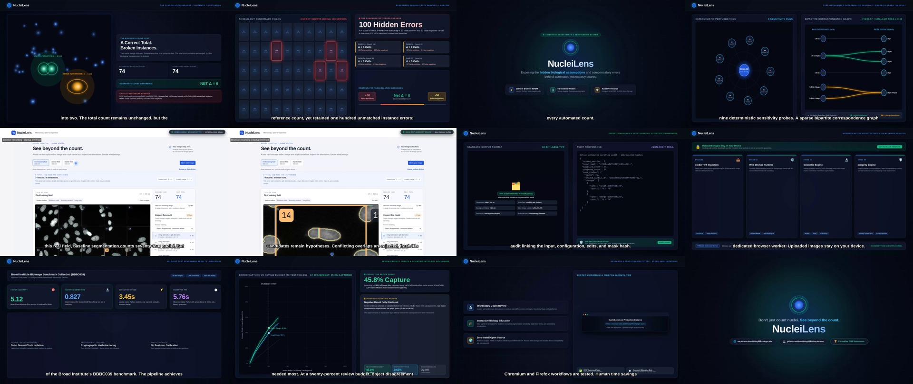

# Published storyboard

Timing follows the assembled215-second master. Review corrections supersede the
original production storyboard; see [review](../docs/hackathon/video-review.md).
The video predates the later model-QA addition and does not demonstrate neural
inference in the browser.

| Scene | Start/end seconds | Published sequence |
|---|---|---|
| 1 | 0.0–13.0 | Labeled schematic: count cancellation |
| 2 | 13.0–29.0 | Frozen benchmark count cancellation |
| 3 | 29.0–39.0 | Product value proposition |
| 4 | 39.0–60.0 | Correspondence mechanism |
| 5 | 60.0–83.0 | Actual sample review |
| 6 | 83.0–105.0 | Actual mask replacement and undo |
| 7 | 105.0–120.0 | Real audit excerpt and TIFF export |
| 8 | 120.0–143.0 | Browser architecture with network caveat |
| 9 | 143.0–165.0 | Frozen native benchmark results |
| 10 | 165.0–193.0 | Review queue comparison and negative result |
| 11 | 193.0–208.0 | Research/education scope and limitations |
| 12 | 208.0–215.0 | Project links and ending |

