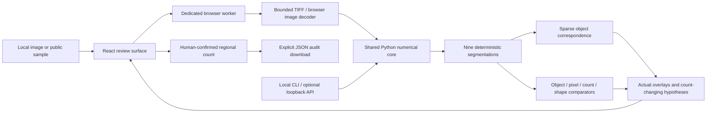
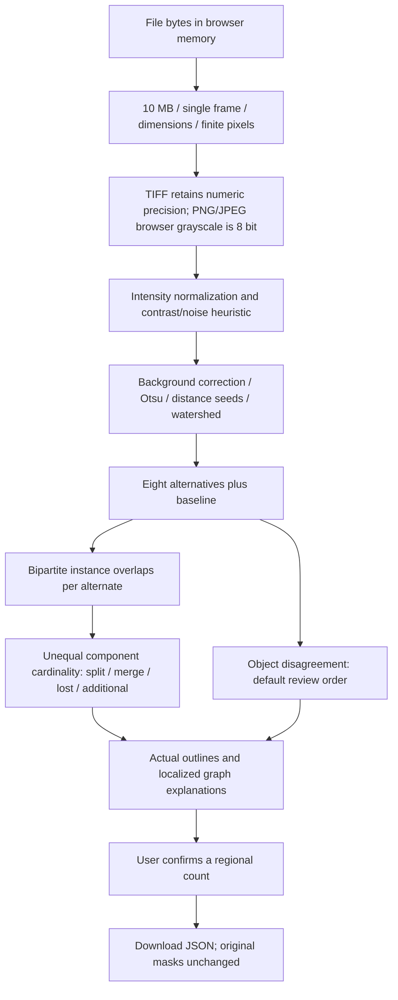
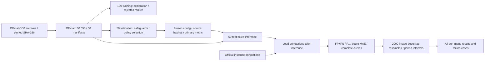

# Architecture

Implemented October 8, 2026. This document describes the working system, not a proposed backend.

## System overview

The public deployment is a static React/TypeScript application. A dedicated browser worker loads a self-hosted, pinned Pyodide scientific runtime and executes the same numerical Python analysis package used by the CLI and benchmark. No application backend, LLM, account, database, or inference API is required. Bundled reference runs open immediately and are explicitly marked precomputed; rerunning performs real device-local inference.

## Components and reasons

| Component | Responsibility | Reason |
|---|---|---|
| `core.py` | Normalize, assess weak signal, segment, generate nine sensitivity probes, assign 20 review tiles | Transparent deterministic numerical mechanism |
| `graph.py` | Sparse overlap pairs, union-find components, count-changing graph events, object disagreement | Explain local split/merge alternatives without dense pixel graphs |
| `raster.py` | Native bounded decoding; output PNG encoder and serializable analysis | Consistent product output; pure numerical PNG encoder avoids a browser Pillow dependency |
| `engine-worker.js` | Decode bounded local files, load pinned runtime, run Python outside UI thread | Device-local compute, native TIFF precision, cancellation boundary |
| React surface | Compare masks, inspect events, choose counts, confirm/undo, export | Human decision support with actual analysis and explicit semantics |
| `data.py` / `evaluate.py` | Verify public archives, official splits, downstream annotation matching, equal-budget comparisons | Reproducible evaluation isolated from inference |
| `api.py` | Optional local CPU companion | Recovery path where browser memory/runtime is unsuitable; never deployed publicly |

## Data flow

Each alternate is compared independently with the baseline. An edge needs intersection coverage of at least 45% of the smaller object. Count-neutral components contribute no graph event, while the object-disagreement comparator still measures mask instability. A field with equal total counts may contain opposing graph events; the signature example is computed from the bundled first training field. Such events are hypotheses, not ground-truth diagnoses.

Segmentation always runs on the complete field. The fixed 4×5 grid allocates counts, events, and benchmark errors by centroid; it does not crop or split masks. Tile boundaries can still affect attribution. Object disagreement is the selected default because it outperformed graph ranking on validation. The rejected NNLS model is an evaluation artifact only.

## Interfaces and storage

- Worker messages: `analyze` with copied ArrayBuffer; `status`, `ready`, `result`, or `error` responses. Results include input pixel hash, software/configuration, actual counts, per-run overlays, regions, event bounds, comparators, timing, and limitations.
- Static `samples/manifest.json` links actual public TIFF fields and precomputed analyses. Reference annotations are displayed only as explicitly labeled benchmark metadata; inference does not receive them.
- `GET /api/health` and raw-byte `POST /api/analyze` exist only in the optional local companion. No samples API, image URL ingestion, arbitrary configuration endpoint, account, or database exists.
- Manual review state lives in client memory. Compatible same-input/configuration/baseline reviews survive reruns. Export records manual count deltas and declares that masks were not modified. Refreshing the page clears unsaved review state; export before leaving.

## Evaluation pipeline

Primary matching is cardinality-first Hungarian assignment with IoU ≥ 0.5. All policies receive the same 4/20 tile budget; ties use expected uniform capture. Secondary local-count/oracle simulations are labeled separately. The frozen test process was interrupted by an environment restart and repeated without protocol/source/config changes; the complete saved output matches the frozen hashes. Test results were not used to tune the algorithm.

## Security and failure boundaries

No project analysis server receives browser image bytes. Hosting still sees normal request metadata. Browser code bounds file/decoded sizes, validates dimensions before decoding, uses a worker, exposes cancellation, and terminates at 90 seconds. Scientific runtime assets are downloaded on first use; cold latency is material. There is no guarantee of regulatory compliance, zero browser vulnerabilities, or persistent offline availability.

The optional native service restricts Host and analysis Origin, bounds input streams, and admits only two concurrent jobs. Its body-read deadline is five seconds. CPU work has no hard process timeout; public exposure is unsupported. No application secrets or model tools exist. See [security review](security-review.md).

## Deployment, observability, and recovery

Production: https://nuclei-lens.dumbthing999.chatgpt.site. The Site has public access and a saved source/archive provenance. Local Vite preview serves a production build for staging checks. CI builds from pinned dependencies and runs scientific and real browser checks. Application states surface worker failures without collecting private images. Audit JSON, complete evaluation records, checked source, and local setup provide a recovery path; a separate backup production origin is not yet verified. See the release/deployment records for actual versions and checks.
