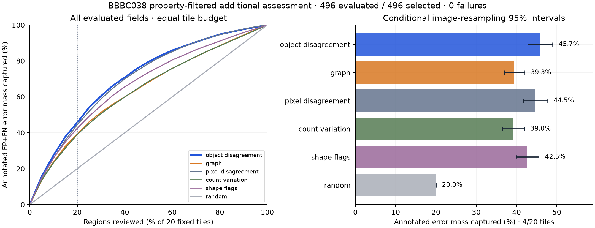
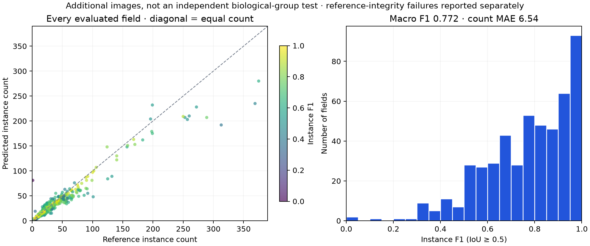
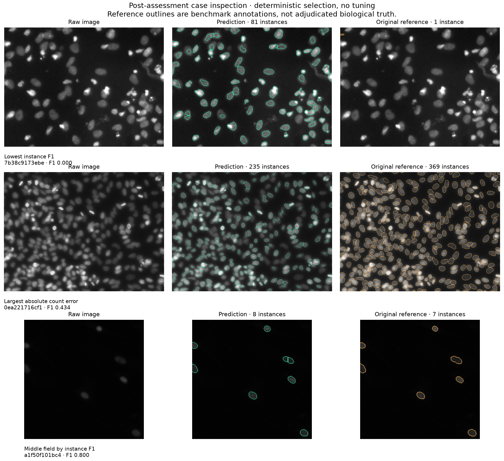

# Additional assessment — complete, unchanged inference

BBBC038v1 CC0 original labeled stage1 training archive; **not its official
competition test set**.670 raw images →539 predeclared image-property candidates
→43 potential same-size content overlaps excluded →**496 selected and evaluated**,
**0 structural reference/inference failures**. No image was dropped after scoring.

Frozen protocol and source were publicly published in commit
[a242d741](https://github.com/dumbthing999-ui/nuclei-lens/commit/a242d74134919e408050444b1bf321c05c764069)
before real annotation decoding or inference; CI37748707090 passed. Frozen protocol
SHA256: `1a995bdc47714f047d7eb434c6c2f5f8a275a2f78e82e32eb9a00b77f42f1dd9`. The original inference/configuration are unchanged.

## Complete results

Count MAE **6.54**, mean per-image instance F1 **0.772**,
micro F1 **0.715**; total annotated FP+FN error mass **10047**.
Instance matching is cardinality-first at IoU≥0.5. All policies use the same4of20
fixed centroid tiles and expected tie capture. Object disagreement was preselected
on BBBC039 validation; it was not selected or tuned on these additional results.

| Policy | Error capture at20% budget | Conditional image-resampling95% interval |
|---|---:|---:|
| graph | 39.3% | 37.0–42.0% |
| pixel disagreement | 44.5% | 41.7–47.7% |
| object disagreement | 45.7% | 42.8–49.0% |
| count variation | 39.0% | 36.5–41.9% |
| shape flags | 42.5% | 39.9–45.6% |
| random | 20.0% | 20.0–20.0% |





The lower quartile F1 is0.656, median0.800, upper quartile0.932.37fields have F1<0.5;
two have F1=0. These remain in every aggregate. The largest absolute count error
is134 (prediction235/reference369). Original reference quality is a limitation:
the lowest-F1 example has81 predictions but only one original reference mask, which
appears sparse relative to visible objects. This is a visual concern, not an
adjudicated annotation correction. It is retained unchanged and does not become
a post-result exclusion. Zero structural failures does not mean perfect labels.



Case selection is post-hoc/descriptive and fixed by saved metrics: minimum F1,
maximum absolute count error, middle sorted F1; filename breaks ties. All three
illustrative reruns reproduce saved metrics under unchanged code/configuration.
These are reference comparisons, not biological diagnoses or human validation.

## What this supports

The preselected object queue concentrates annotated errors on this additional
property-filtered set, with45.7% capture versus20% expected random. Graph ranking
remains lower at39.3%; it serves as an explanation and mask-alternative mechanism.
Segmentation macro F1 is lower than the original BBBC039 frozen test (.772 versus
.827). No inference parameter was changed to improve this result.

## What it does not support

- Independent biological generalization: crop/resampling/shared-source overlap may
  remain after43 potential same-size overlaps were excluded. Per-image cell/source
  group identity is unknown; images are not proven statistically independent.
- General microscopy/modality validity: monochrome/opaque/dark-background properties
  do not independently establish fluorescence; BBBC038 has mixed sources/modalities.
- Human review accuracy, effort/time savings, clinical utility or corrected masks.
- Perfect annotations: structurally valid original masks may be incomplete/wrong.
- A direct causal comparison between datasets: image sizes, sources and annotation
  quality differ. Conditional image-resampling intervals are descriptive only.
- An isolated speed benchmark: median native analysis532.17ms
  is observed on this machine; a Firefox check ran concurrently during part of the
  assessment. The mostly smaller additional fields differ from BBBC039 dimensions.

## Reproduce and inspect

Source/provenance/selection: [research assessment](../../research/external-assessment/README.md).
Complete [summary](summary.json), [496 per-image records](per-image.json),
[frozen protocol](frozen-protocol.json), [integrity check](integrity-check.json),
[case selections](case-inspection.json).

```bash
.venv/bin/python scripts/evaluate_external.py --run
# Explicit same-protocol resume if interrupted:
.venv/bin/python scripts/evaluate_external.py --run --resume
.venv/bin/python scripts/check_additional.py
.venv/bin/python scripts/plot_additional.py
.venv/bin/python scripts/inspect_additional_cases.py
```

The separate saved-record checker verifies complete coverage, frozen sources and
selection-file hashes, count/FP/FN arithmetic, tile assignments, every primary
curve, and56,544 independent cutoff/tie calculations. It is a software/data
integrity check, not an independent biological annotation study.

Published per-image JSON is losslessly compacted to fit the publishing proxy
payload limit; all496 parsed records are unchanged. Native reproduction writes
pretty JSON with the same values. [Formatting checksums](record-format.json)
record this packaging adjustment; it is not an evaluation change.
