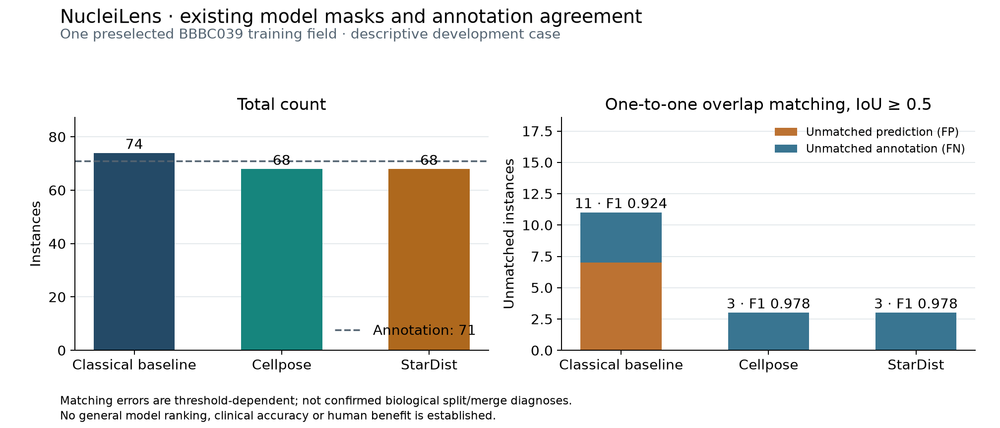

# Existing model masks: single-field annotation diagnostic

This is a descriptive examination of the existing first BBBC039 training example,
not a held-out comparison or a new segmentation algorithm. All three predictions
already exist. Their images, counts and masks were public before this diagnostic
was declared; the new measurements must not be called independent confirmation.

The [protocol](protocol.json) fixes that one field, all three methods, source/
archive/prediction hashes and IoU0.5 cardinality-first matching. It is committed
before calculating these new diagnostic results. No annotation enters inference;
this workflow only scores existing predictions after verifying them. The existing
50-field and 496-field protocols/results remain unchanged. Fixed0.1IoU merge/split
hypotheses are diagnostics, not verified biological mistakes. Keep every method
and any failure; do not tune or select by the outcome.

## Actual result

The annotation decoder yields 71 instances. Matching uses one-to-one instance
IoU ≥ 0.5, with cardinality before summed overlap. All three masks have an absolute count error of 3
on this one field; their unmatched-instance totals differ.

| Existing mask | Count | Signed count error | TP | FP | FN | FP+FN | F1 |
|---|---:|---:|---:|---:|---:|---:|---:|
| Classical baseline |74|+3|67|7|4|11|0.924|
| Cellpose3 nuclei |68|−3|68|0|3|3|0.978|
| StarDist2D versatile fluo |68|−3|68|0|3|3|0.978|



Cellpose and StarDist have identical count and aggregate matching metrics here,
yet foreground differs at 3,738 pixels and their partitions are not equivalent
under one-to-one ID relabeling. This does **not** show either model is less accurate
on this field: boundary differences can preserve all eligible IoU matches.
The classical baseline has five 0.1 IoU split hypotheses; these thresholded overlaps
are not five confirmed biological errors. Neither graph differences nor exact
count agreement establishes correctness. Reference quality remains a limitation.

[Complete deterministic result](result.json) retains every method, source/image/
annotation/mask hash, recorded model/weight provenance, versions and limitations.
No prediction, weight, configuration or frozen 50/496 result was changed. This
measurement adds no human-reader benefit, scientific-first or general superiority
claim. The original model-run provenance uses the initial environment; the
separately documented remediated rerun produced identical pixels.

## Reproduce

Use the ordinary project environment; no neural frameworks, weights or new model
inference are needed. Download and verify the official archives if not present:

```bash
.venv/bin/python scripts/download_data.py
.venv/bin/python scripts/annotated_model_case.py --output /tmp/nucleilens-annotation-case.json
cmp evaluation/model-case/result.json /tmp/nucleilens-annotation-case.json
.venv/bin/python scripts/plot_annotated_model_case.py --output-directory /tmp/nucleilens-case-figures
```

The result is byte-repeatable in the checked pinned environment. Differing prior
output is rejected. Figure byte equality was checked on this machine, not promised
across operating systems/renderers. Synthetic tests cover hash/geometry/threshold/
label-ID/annotation-ordering/overwrite guards; they are not model or human evidence.
CI repeats the real case from hash-pinned official archives and compares the JSON.
